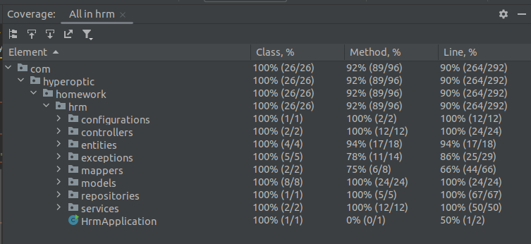

# HR Management Application

This project was created as a result of a homework assignment and represents a small but functional HR management application. It aims to help the HR team keep track of employees and teams.

## Features

Some functionalities and features of the application include:

- **REST CRUD Operations**: The application supports CRUD (Create, Read, Update, Delete) operations for relevant resources, allowing you to manage employees and teams efficiently.

- **Search Functionality**: You can search for resources using REST endpoints with multiple optional filters. This makes it easy to find the information you need.

## Technologies Used

- **Spring Boot**: The project was developed using Spring Boot, which provides a robust and easy-to-use framework for building Java applications.

- **Java 17**: The application is written in Java 17, taking advantage of its features and capabilities.

- **MySQL Database**: A MySQL relational database is used for data storage. To connect the application to the database, follow the instructions below.

## Database Setup

To connect the application to the MySQL database, follow these steps:

1. Create a MySQL database instance.

2. Set the following environment variables with your database information:

   - `DATASOURCE_PASSWORD` (e.g. root)
   - `DATASOURCE_USERNAME` (e.g. root)
   - `DB_WRITER` (e.g., localhost:3306)

## REST Documentation

To explore the REST API documentation in detail, follow these steps:

1. Launch the application.

2. Access the following link: [http://localhost:8080/swagger-ui/index.html](http://localhost:8080/swagger-ui/index.html)

   (Note: The default port is 8080, but it may be different if you've configured a different port in your application.)
   
## Postman Collection

In the `postman` folder of this repository, you'll find a collection of all available requests that can be imported and used for testing. The collection is provided to facilitate testing and interaction with the HR management API.

## Testing and Code Coverage

I have conducted comprehensive testing for this application, including unit and integration tests for all important components, such as controllers, services, custom repositories, and configurations.

Here is the code coverage report for our tests:

